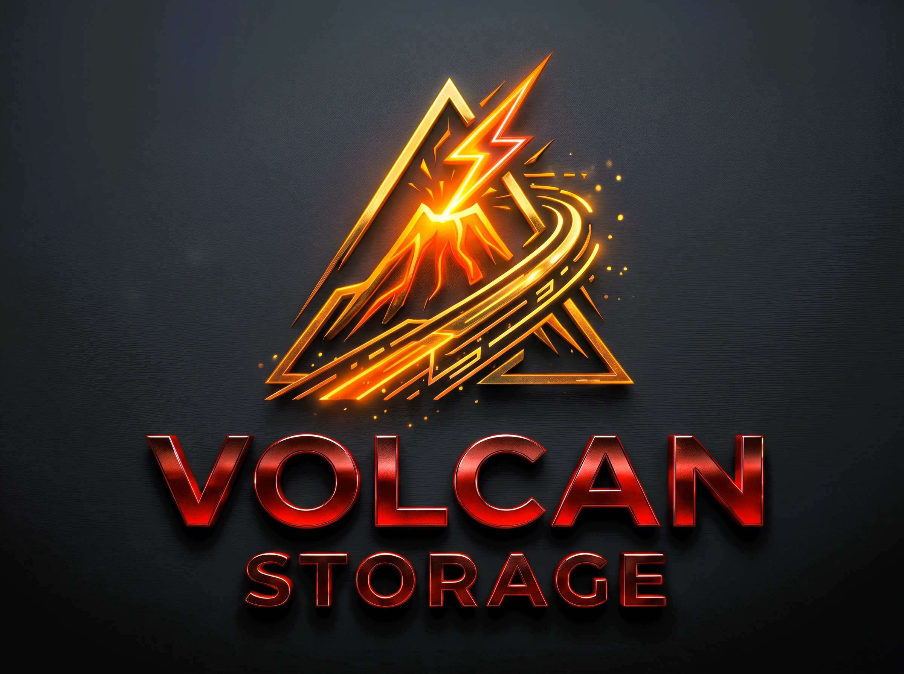

<p align="center">
  
</p>

<h1 align="center">VolcanStorage</h1>

<p align="center">
  <a href="https://en.cppreference.com/w/cpp/20"></a>
  <a href="https://www.vulkan.org/"></a>
  <a href="https://microsoft.com/windows"></a>
  <a href="https://kernel.org"></a>
  <a href="https://apple.com/macos"></a>
  <br>
  <a href="https://github.com/ahmetenesay/VolcanStorage/releases"></a>
  <a href="LICENSE"></a>
  
  <a href="Docs/VolcanStorage_Developer_Guide.pdf"></a>
</p>

**VolcanStorage** is a lightweight, cross-platform asynchronous GPU asset streaming and staging queue built on **Vulkan 1.1 – 1.4** and modern **C++20**. Operating strictly in user-space (Ring 3), it delivers smooth, stutter-free texture and buffer streaming for Vulkan game engines using persistent staging ring-buffers, ReBAR host-visible VRAM, and 64-bit Timeline Semaphores.

---

## 🚀 Key Features

* **Cross-Platform Asynchronous I/O**:
  * **Windows**: Native Win32 `FILE_FLAG_OVERLAPPED` and I/O Completion Ports (IOCP).
  * **Linux**: High-throughput POSIX `pread` with signal retry loops (native `io_uring` on roadmap).
  * **macOS / iOS (Apple Silicon)**: Unified Memory Architecture (UMA) zero-copy staging via MoltenVK.
* **Top-Down Feature Tiers & Graceful Downgrade**:
  * **Tier 3 (Vulkan 1.3 / 1.4)**: `Synchronization2` (`vkCmdPipelineBarrier2`), 64-bit `Timeline Semaphores`, async compute decompression.
  * **Tier 2 (Vulkan 1.2)**: `Timeline Semaphores` (monotonic 64-bit fence equivalent), persistent staging pools.
  * **Tier 1 (Vulkan 1.1 Fallback)**: Binary `VkFence`, multithreaded CPU decompression fallback. Never crashes on older hardware or drivers.
* **Hardware-Aware Staging & Memory Engine**:
  * Automatically detects **UMA (Apple Silicon, ARM SoC, AMD APU)** and **Resizable BAR (ReBAR)** on discrete GPUs.
  * Streams Direct I/O chunks into host-visible VRAM, minimizing redundant host RAM staging allocations and copies.
* **Persistent Staging Ring-Buffer Pool (64 MB)**:
  * Eliminates per-request `vkAllocateMemory` and `vkCreateBuffer` overhead, delivering sub-millisecond continuous streaming for open-world games and large virtual textures.
* **Multi-Target Streaming**:
  * Stream into **`VkBuffer`** (geometry, vertex buffers, index buffers, uniforms).
  * Stream into **`VkImage`** (textures with automatic pipeline layout transition to `SHADER_READ_ONLY_OPTIMAL`).
  * Stream into host **`Memory`** (CPU RAM).
* **NVIDIA GDeflate Decompression**:
  * Fast SIMD CPU decompression with bundled GDeflate GLSL compute shaders (`shaders/GDeflate.comp` SPIR-V) for async compute queue integration.
* **Pure Vulkan & Zero DirectX Dependencies**:
  * 100% vendor-agnostic (AMD, NVIDIA, Intel, Apple, Qualcomm). No D3D12, DXGI, COM, or Windows-specific runtimes required.

---

## 📊 DirectStorage vs. VolcanStorage

| Architectural Dimension | Microsoft DirectStorage | VolcanStorage Runtime |
| :--- | :---: | :---: |
| **Graphics API** | DirectX 12 only (Closed D3D12 device binding) | **Vulkan 1.1 – 1.4 Native** (Cross-vendor) |
| **Operating System** | Windows 10/11 only | **Windows, Linux, macOS (Apple Silicon / MoltenVK)** |
| **Source Availability** | Closed-source proprietary binary (`dstorage.dll`) | **100% Open Source (MIT License)** |
| **Execution Domain** | Windows Kernel BypassIO + User-mode DLL | **Strict User-Mode (Ring 3) Vulkan Runtime** |
| **Compute Shaders** | HLSL Shader Model 6.0 DXIL | **GLSL #version 450 SPIR-V bytecode** |
| **GPU Architecture** | Discrete PC & Xbox | **Discrete PCIe (ReBAR), Apple Silicon UMA, ARM SoC, APUs** |
| **Fence Signaling** | `ID3D12Fence` (64-bit monotonic) | **Vulkan Timeline Semaphores** (`uint64_t`) |
| **Decompression** | GDeflate (D3D12 Compute) | **GDeflate (CPU SIMD + GLSL Compute SPIR-V)** |
| **Storage I/O** | Windows BypassIO | **Windows IOCP / Overlapped & Linux pread (`io_uring` roadmap)** |

---

## 🛠️ Building & Packaging

### Prerequisites
* CMake 3.20 or newer
* C++20 compliant compiler (MSVC 2022/2026, GCC 12+, Clang 15+)
* **Vulkan SDK** (automatically detected via `$ENV{VULKAN_SDK}` or `$ENV{VK_SDK_PATH}`)

### Build with CMake
```bash
# Configure
cmake -B build -S . -DCMAKE_BUILD_TYPE=Release

# Build
cmake --build build --config Release

# Automated Multiplatform Zip Packaging (Generates dist/*.zip with bin, inc, docs, licenses):
cmake --build build --config Release --target package_zip
```

---

## 💻 Quick Code Example

```cpp
#include <volcanstorage/volcanstorage.h>

using namespace volcanstorage;

// 1. Obtain VolcanStorage Singleton Factory
IVolcanStorageFactory* factory = nullptr;
VolcanStorageGetFactory(&factory);

// 2. Open File Asynchronously
IVolcanStorageFile* file = nullptr;
factory->OpenFile("textures_4k.volcan", &file);

// 3. Create Storage Queue with 64 MB Persistent Ring Buffer
QueueDesc qDesc{};
qDesc.Device = vkDevice;
qDesc.PhysicalDevice = vkPhysicalDevice;
qDesc.TransferQueue = vkTransferQueue;
qDesc.TransferQueueFamilyIndex = queueFamilyIndex;
qDesc.Capacity = 2048;
qDesc.StagingBufferSize = 64 * 1024 * 1024; // 64 MB

IVolcanStorageQueue* streamQueue = nullptr;
factory->CreateQueue(qDesc, &streamQueue);

// 4. Enqueue Asynchronous Stream Request into VkImage (VRAM)
Request req{};
req.DestType = DestinationType::Image;
req.SourceFile = file;
req.SourceOffset = 0;
req.SourceSize = 4194304; // 4 MB
req.DestinationImage.Image = targetVkImage;
req.DestinationImage.ImageExtent = { 1024, 1024, 1 };
req.DestinationImage.FinalLayout = VK_IMAGE_LAYOUT_SHADER_READ_ONLY_OPTIMAL;

streamQueue->EnqueueRequest(req);

// 5. Enqueue 64-bit Timeline Semaphore Signal and Submit
streamQueue->EnqueueSignalTimeline(storageTimelineSemaphore, 1);
streamQueue->Submit();

// The texture streams smoothly into GPU VRAM and transitions layout without blocking the render loop!
```

---

## ⚖️ Legal, Licensing & Trademarks

VolcanStorage is an independent, clean-room open-source project authored by **Ahmet Enes (Chiretallyn)** and contributors, published under the **[MIT License](LICENSE)**.

### Third-Party Open-Source Attributions
* **Microsoft DirectStorage Samples:** Copyright (c) Microsoft Corporation. Licensed under the MIT License.
* **NVIDIA GDeflate Codec:** Copyright (c) 2020–2022 NVIDIA CORPORATION & AFFILIATES, and Microsoft Corporation. Licensed under the Apache License, Version 2.0.
* **libdeflate:** Copyright 2016–2022 Eric Biggers. Licensed under the MIT License.

For full license texts and notices, see **[NOTICES.txt](NOTICES.txt)**.

### Trademarks and Non-Affiliation Disclaimer
*VolcanStorage is an independent open-source project and is NOT affiliated with, sponsored by, endorsed by, or in any way officially associated with Microsoft Corporation, NVIDIA Corporation, or the Khronos Group Inc.*
* "DirectStorage", "DirectX", and "Windows" are registered trademarks or trademarks of Microsoft Corporation in the United States and/or other countries.
* "Vulkan" and the Vulkan logo are registered trademarks of the Khronos Group Inc.
* "NVIDIA", "GeForce", and "GDeflate" are trademarks or registered trademarks of NVIDIA Corporation.
* "Apple", "macOS", and "Metal" are registered trademarks of Apple Inc.
* "Linux" is the registered trademark of Linus Torvalds in the U.S. and other countries.
* All other trademarks and logos belong to their respective owners.
